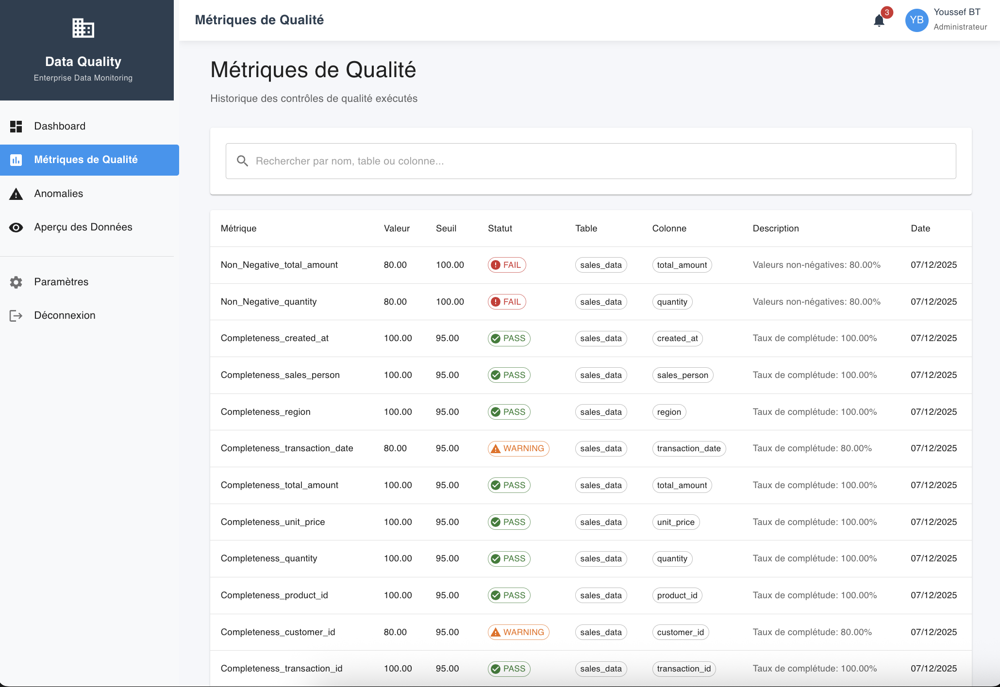
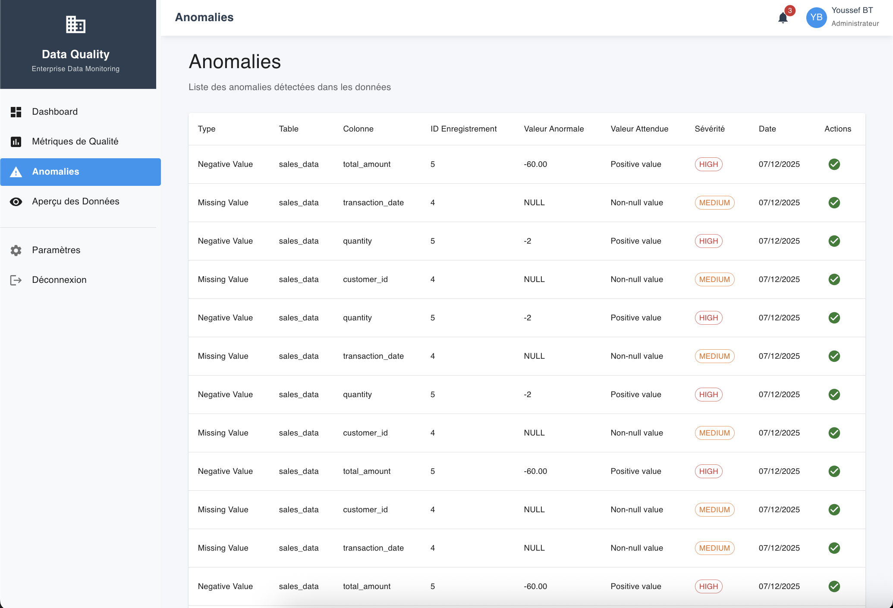
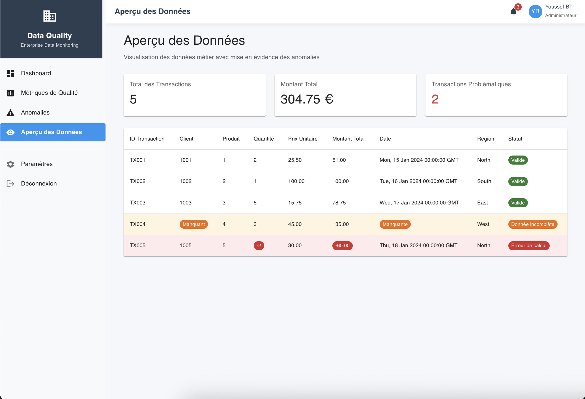

#                                                **🎯 Data Quality Monitoring Platform**


**Plateforme professionnelle de surveillance de la qualité des données avec dashboard interactif, rapports automatisés et API REST**

---

## **📊 LIVE DEMO**
- **Frontend Dashboard**: [data-quality-dashboard.netlify.app](https://data-quality-dashboard.netlify.app)
- **Backend API**: `http://localhost:5001/api/quality-summary`⏳
- **Source Code**: [GitHub Repository](https://github.com/YOUSSEF-BT/Data-Quality-Monitoring)

---

## **🚀 FONCTIONNALITÉS PRINCIPALES**

### **📈 Tableau de Bord Temps Réel**
- Monitoring en direct des KPI de qualité des données
- Visualisations interactives avec Chart.js
- Métriques calculées automatiquement
- Interface responsive Material-UI

### **🔍 Contrôles Automatisés**
- Validation de complétude des données
- Détection d'anomalies en temps réel
- Vérification des contraintes d'intégrité
- Historique des contrôles exécutés

### **📤 Rapports Professionnels**
- Export PDF avec mise en forme avancée
- Génération de fichiers Excel/CSV
- Rapports personnalisables par période
- Emailing automatique des rapports

### **🔧 API REST Complète**
- Endpoints RESTful pour l'intégration
- Documentation Swagger intégrée
- Authentification JWT (optionnel)
- Logs détaillés d'activité

---

## **🖼️ SCREENSHOTS DU DASHBOARD**

### **1. 📊 Tableau de Bord - Qualité des Données**

*Vue d'ensemble des indicateurs clés avec graphiques interactifs et métriques en temps réel.*

### **2. 📈 Métriques de Qualité**

*Détail des métriques de qualité par colonne avec statuts PASS/WARNING/FAIL et tendances historiques.*

### **3. ⚠️ Anomalies Détectées**

*Tableau des anomalies identifiées avec priorité, statut et actions correctives recommandées.*

### **4. 🔍 Aperçu des Données**

*Visualisation des données brutes avec filtrage, tri et recherche avancée.*

---

## **🏗️ ARCHITECTURE TECHNIQUE**

```
data-quality-monitoring/
├── 📁 frontend/                 # Application React Dashboard
│   ├── 📁 src/components/      # Composants réutilisables
│   ├── 📁 src/pages/           # Pages principales
│   ├── 📁 src/services/        # Appels API
│   └── 📁 src/utils/           # Utilitaires
├── 📁 backend/                 # API Python Flask
│   ├── app.py                  # Application principale
│   ├── requirements.txt        # Dépendances Python
│   ├── 📁 database/           # Configuration DB
│   ├── 📁 models/             # Modèles de données
│   └── 📁 routes/             # Routes API
├── 📁 database/               # Scripts MySQL
│   ├── schema.sql            # Structure de base
│   └── seed.sql              # Données de test
└── 📁 screenshots/           # Captures d'écran
```

---

## **🛠️ TECHNOLOGIES UTILISÉES**

| Composant | Technologies |
|-----------|-------------|
| **Frontend** | React 18, Material-UI, Chart.js, jsPDF, Axios |
| **Backend** | Python Flask, MySQL Connector, Flask-CORS |
| **Base de Données** | MySQL 8.0, Indexation avancée |
| **DevOps** | Netlify, Railway, Git, GitHub Actions |
| **Monitoring** | Logging personnalisé, Métriques temps réel |

---

## **⚡ INSTALLATION RAPIDE**

### **Prérequis**
- Node.js 18+ et npm
- Python 3.10+
- MySQL 8.0+

### **1. Cloner le projet**
```bash
git clone https://github.com/YOUSSEF-BT/Data-Quality-Monitoring.git
cd data-quality-monitoring
```

### **2. Configurer le Backend (Python)**
```bash
cd backend
pip install -r requirements.txt
# Configurer .env avec vos paramètres MySQL
python app.py
```

### **3. Configurer le Frontend (React)**
```bash
cd frontend
npm install
npm start
```

### **4. Accéder à l'application**
- **Frontend** : http://localhost:3000
- **Backend API** : http://localhost:5001
- **API Docs** : http://localhost:5001/api-docs

---

## **🔗 API ENDPOINTS**

| Méthode | Endpoint | Description |
|---------|----------|-------------|
| GET | `/api/quality-summary` | Résumé dashboard |
| GET | `/api/quality-metrics` | Métriques détaillées |
| GET | `/api/anomalies` | Liste anomalies |
| GET | `/api/sales-data` | Données brutes |
| POST | `/api/run-checks` | Exécuter contrôles |
| GET | `/api/export/pdf` | Générer PDF |

**Exemple de requête :**
```bash
curl -X GET "http://localhost:5001/api/quality-summary"
```

---

## **🌐 DÉPLOIEMENT**

### **Frontend (Netlify)**
1. Build : `npm run build`
2. Déployer dossier `build/` sur Netlify
3. Variables d'environnement :
   ```
   REACT_APP_API_URL=https://votre-api.railway.app
   ```

### **Backend (Railway)**
1. Créer `Procfile` : `web: gunicorn app:app`
2. Push sur GitHub
3. Railway détecte automatiquement Python + MySQL
4. Configurer variables d'environnement

### **Base de Données (MySQL)**
1. Railway fournit MySQL gratuitement
2. Exécuter `schema.sql`
3. Configurer connexion dans variables d'environnement

---

## **📊 DONNÉES DE DÉMONSTRATION**

Votre API retourne des données réalistes :
```json
{
  "success_rate": 69,
  "passed_checks": 69,
  "failed_checks": 31,
  "total_anomalies": 50,
  "metrics": [
    {"name": "Complétude", "value": 85, "target": 90},
    {"name": "Exactitude", "value": 78, "target": 85},
    {"name": "Cohérence", "value": 92, "target": 95}
  ]
}
```

---

## **🚀 UTILISATION EN PRODUCTION**

### **Scénarios d'Usage**
- **Secteur Financier** : Validation des transactions
- **Santé** : Qualité des données patients
- **E-commerce** : Cohérence des produits
- **Logistique** : Traçabilité des données

### **Avantages Clés**
- ✅ **Temps réel** : Monitoring immédiat
- ✅ **Automatisé** : Réduit l'effort manuel
- ✅ **Scalable** : Gère des millions d'enregistrements
- ✅ **Rapports** : Export PDF/Excel professionnels

---

## **🤝 CONTRIBUTION**

1. Fork le projet
2. Créer une branche (`git checkout -b feature/AmazingFeature`)
3. Commit vos changements (`git commit -m 'Add AmazingFeature'`)
4. Push vers la branche (`git push origin feature/AmazingFeature`)
5. Ouvrir une Pull Request

---

## **📝 LICENCE**

Distribué sous licence MIT. Voir `LICENSE` pour plus d'informations.

---

## **👨‍💻 AUTEUR**

**Youssef - Data Scientist & Full-Stack Developer**
- Email : bt.youssef.369@gmail.com
- GitHub : [github.com/YOUSSEF-BT](https://github.com/YOUSSEF-BT)
- LinkedIn : [in/youssef-bt-74863239b](https://linkedin.com/in/youssef-bt-74863239b)

---

## **⭐ SUPPORT**

Si vous trouvez ce projet utile, pensez à :
1. ⭐ **Star** le repository sur GitHub
2. 🔗 **Partager** avec vos collègues
3. 🐛 **Signaler** les issues
4. 💡 **Proposer** des améliorations

---

## **📞 CONTACT**

Pour toute question ou collaboration :
- **Email** : bt.youssef.369@gmail.com
- **GitHub Issues** : [Nouvelle Issue](https://github.com/YOUSSEF-BT/Data-Quality-Monitoring/issues)
- **LinkedIn** : [Message Privé](https://linkedin.com/in/youssef-bt-74863239b)

---

**✨ Fait avec ❤️ pour la communauté Data Quality**

---

## **🔗 LIENS UTILES**

- [📚 Documentation Technique](docs/)
- [🐛 Bug Tracker](https://github.com/YOUSSEF-BT/Data-Quality-Monitoring/issues)
- [💡 Feature Requests](https://github.com/YOUSSEF-BT/Data-Quality-Monitoring/issues)
- [📊 Roadmap](ROADMAP.md)
- [🤝 Code de Conduite](CODE_OF_CONDUCT.md)

---

**Dernière mise à jour : Décembre 2025**
